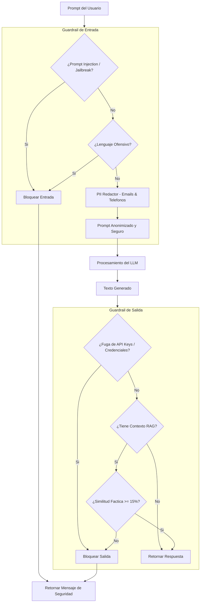

# LLM Guardrails Shield

Cortafuegos de seguridad bidireccional modular (Guardrails) disenado para interceptar, evaluar y mitigar riesgos operacionales en la interaccion con modelos de lenguaje (LLMs) tanto en la entrada (Prompts de usuarios) como en la salida (generaciones del modelo).

Este sistema garantiza el cumplimiento de politicas de privacidad, evita ataques ciberneticos dirigidos a anular directrices (Jailbreaks) y asegura la veracidad de la informacion devuelta por el LLM en arquitecturas de Generacion Aumentada por Recuperacion (RAG), bloqueando alucinaciones y fugas accidentales de secretos.

## Arquitectura de Evaluacion Bidireccional

El cortafuegos opera de manera síncrona en el pipeline de datos mediante dos capas independientes de inspeccion automatica.



### 1. Guardrail de Entrada (Input Safeguards)

Antes de enviar la consulta al LLM o al enrutador, el prompt es analizado por los siguientes filtros heurísticos:

*   **Deteccion de Prompt Injection y Jailbreaks:** Escanea el texto contra patrones compilados de expresiones regulares buscando firmas de ataques clasicos, anulacion de prompts del sistema (ej: `"ignore all previous instructions"`), llamadas al modo DAN (`"DAN mode"`) o comandos de override directo del prompt de sistema `[system: override]`.
*   **Filtro de Lenguaje Ofensivo:** Busca correspondencias explicitas a nivel de frontera de palabra (`\b{termino}\b`) contra una lista personalizable de palabras toxicas en espanol, previniendo abusos en interfaces conversacionales.
*   **Redaccion de Informacion de Identificacion Personal (PII):** Anonimiza datos sensibles reemplazandolos por placeholders (`[EMAIL]` y `[PHONE]`) para evitar la exposicion involuntaria de datos a APIs externas.
    *   *Emails Regex:* `\b[A-Za-z0-9._%+-]+@[A-Za-z0-9.-]+\.[A-Z|a-z]{2,7}\b`
    *   *Telefonos Regex:* `\b(?:\+?\d{1,3}[-.\s]?)?\(?\d{2,3}\)?[-.\s]?\d{3}[-.\s]?\d{3,4}\b` (disenada para capturar formatos telefonicos espanoles con o sin prefijo internacional e intervalos de espaciado o guiones).

### 2. Guardrail de Salida (Output Safeguards)

Una vez que el modelo devuelve una respuesta, esta se somete a controles estrictos de seguridad antes de ser servida al cliente:

*   **Prevencion de Fugas de Secretos (Secret Leakage Block):** Identifica expresiones de seguridad como tokens de autenticacion de OpenAI (`sk-...`), credenciales de la consola de Google (`AIzaSy...`) o patrones generales de almacenamiento de variables de configuracion (`password=...`, `apikey=...`). De encontrar coincidencias, se anula la entrega para evitar el compromiso de infraestructura.
*   **Control de Alucinacion y Consistencia Factica (Fact-Checking RAG):** Valida la alineacion de la respuesta respecto a los documentos que sirvieron como contexto de busqueda. 
    1.  Se extraen los conjuntos de palabras unicas con longitud mayor o igual a 4 caracteres de la generacion ($V_{\text{gen}}$) y del contexto RAG suministrado ($V_{\text{ctx}}$).
    2.  Se calcula el indice de consistencia factica:
        $$R = \frac{|V_{\text{gen}} \cap V_{\text{ctx}}|}{|V_{\text{gen}}|}$$
    3.  Si $R < 0.15$ (menos del 15% de los conceptos de la respuesta estan respaldados por las fuentes de informacion RAG), se asume que el modelo ha alucinado o introducido datos falsos, procediendo al bloqueo inmediato de la salida.

## Conexión con el Ecosistema

Este escudo se integra transversalmente en el ecosistema de la siguiente forma:
1.  **hybrid-search-retrieval-pipeline:** Suministra el contexto factual (documentos recuperados de NanoVectorDB y BM25) para alimentar el validador de salida y comprobar la tasa de alucinaciones.
2.  **orchestra-agents / secure-tool-runtime:** Los prompts de entrada de los agentes y los resultados arrojados por las ejecuciones de herramientas en consola pasan previamente por este filtro para garantizar que no existan intentos de escalado de privilegios u ofensas en el ciclo ReAct.

## Estructura del Proyecto

*   `shield.py`: Implementacion de la clase `LLMGuardrailsShield` con los metodos de PII, inyecciones, toxicidad y fact-checking.
*   `test_shield.py`: Suite de test unitarios que verifican de forma exhaustiva las validaciones bajo casos extremos (inyecciones encubiertas, telefonos complejos, alucinacion controlada y fugas de sk-keys).
*   `example.py`: Script de demostracion interactiva que corre flujos de prueba ofensivos, inyecciones RAG y fugas, visualizando que entra, que sale y las razones detalladas del cortafuegos para intervenir.

## Instalacion y Uso

### 1. Activar el Entorno Local e Instalar Dependencias

Dado que el modulo utiliza expresiones regulares nativas y estructuras livianas de validacion, no requiere aceleracion por hardware:

```bash
python3 -m venv .venv
source .venv/bin/activate
pip install -r requirements.txt
```

### 2. Ejecutar Pruebas de Seguridad Automatizadas

La suite de test valida las politicas de filtrado de PII, inyeccion y consistencia factica:

```bash
.venv/bin/python -m unittest test_shield.py
```

### 3. Ejecutar la Demostracion de Cortafuegos

```bash
.venv/bin/python example.py
```

El script simula ataques y situaciones reales en tiempo real, ilustrando como el cortafuegos purifica un prompt antes de la inferencia y restringe la devolucion de respuestas cuando detecta secretos expuestos o alucinaciones RAG.
